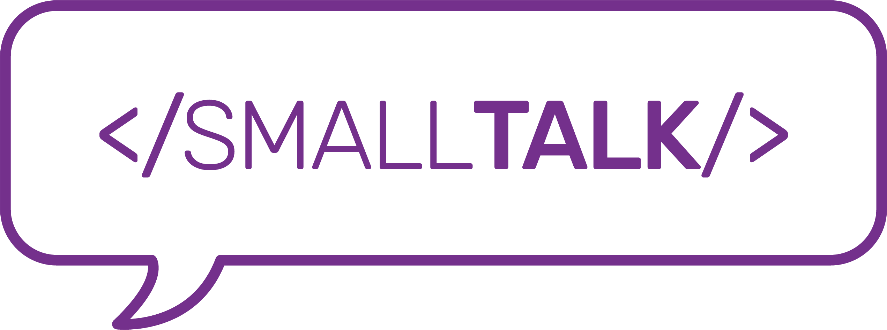

# Small-Talk - VS Code Translator

Quick, easy translation throughout your editor through Google's Translation API.

## Features

Find any language through the the command palette:

Translate to your default language through the status bar button:

Get a simple translation message without adding to your code:

## Requirements

To use this extension, you'll need a Google Translate API key. To get one, simply follow these easy steps:

1) Visit [Google Cloud Platform](https://console.cloud.google.com/) and create a new project if you don't already have one.

2) Visit the [API's](<https://console.cloud.google.com/apis/library>) page. Search and enable the Cloud Translation API.

3) Create a Service Account Key in the Credentials page. Be sure to select Project --> Owner in the roles. You will automatically download a JSON file containing your key and other info. Keep this safe and private.

4) Head to Small-Talk's extension settings (cmd + shift + p and search "workspace settings"). Input the path to your JSON file as well as the project ID on your cloud project in the designated inputs and enjoy!

## Extension Settings

Include if your extension adds any VS Code settings through the `contributes.configuration` extension point.

For example:

This extension contributes the following settings:

* `myExtension.enable`: enable/disable this extension
* `myExtension.thing`: set to `blah` to do something

## Known Issues

Please feel free to email smalltalk.vscode@gmail.com with any bugs or issues you may encounter.

## Release Notes

No updates as of yet.

### 1.0.0

Initial release.

-----------------------------------------------------------------------------------------------------------

**Enjoy!**
